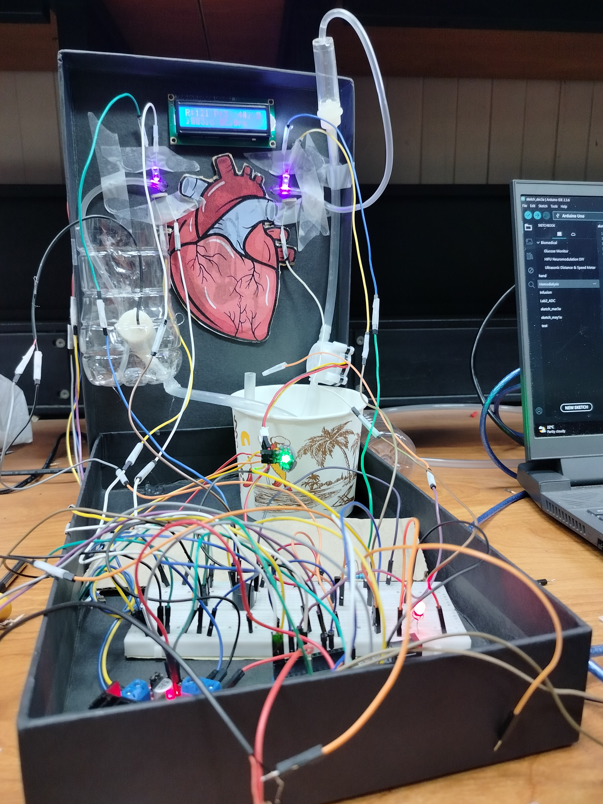

<div align="center">


# 暁 Akatsuki Medical Heart-Lung Machine

**Advanced Monitoring System for Cardiovascular Support**

[](https://www.python.org)
[](https://opencv.org)
[](https://www.arduino.cc)


</div>

---

## 🎯 Overview

The Akatsuki Heart-Lung Machine Monitoring System is a sophisticated medical device prototype designed for real-time monitoring and control of cardiovascular support equipment. Combining computer vision, embedded systems, and modern GUI design, this system provides comprehensive oversight of critical patient parameters during cardiac surgery procedures.

<div align="center">

### 🖼️ Hardware Prototype



*Complete hardware assembly with integrated sensors and monitoring systems*

</div>


---

## ✨ Key Features

<table>
<tr>
<td width="50%" bgcolor="#f0f9ff">

### 📊 Real-Time Monitoring
- **Heart Rate Tracking** - Photoplethysmography (PPG) pulse detection
- **Pressure Monitoring** - Calculated correlation (40-140 mmHg)
- **Temperature Control** - Digital precision thermal regulation (35.5-38.5°C)
- **Oxygen Saturation** - Optical absorption measurement (SPO2 proxy)
- **Bubble Detection** - Optical transmission air embolism prevention
- **Flow Rate Monitoring** - Hall effect turbine sensor

</td>
<td width="50%" bgcolor="#fef3f2">

### 🎮 Advanced Controls
- **Computer Vision** - Liquid level detection via camera
- **Automated Alerts** - Multi-parameter alarm system with debouncing
- **Dual Pump Control** - Main pump (H-Bridge) and suction pump (MOSFET)
- **Serial Communication** - High-speed Arduino interface (115200 baud)
- **Event Logging** - Comprehensive activity tracking
- **Priming Protection** - 5-second initialization grace period

</td>
</tr>
</table>

---

## 🏗️ System Architecture

```
╔════════════════════════╗
║   Camera Feed (CV)     ║  ← 🎥 Liquid Level Detection
║   OpenCV Processing    ║     HSV Color Analysis
╚═══════════╦════════════╝
            ║
            ║ Image Processing
            ▼
╔════════════════════════╗
║  Python Dashboard      ║  ← 🖥️ Tkinter GUI
║  (Main Controller)     ║     Real-time Visualization
╚═══════════╦════════════╝
            ║ Serial @ 115200 baud
            ▼
╔════════════════════════╗
║  Arduino Hardware      ║  ← 🔌 Sensors & Actuators
║  + Medical Sensors     ║     Optical | Temperature | Flow
╚════════════════════════╝
```

---

## 🛠️ Technical Specifications

### Hardware Components

| Component | Specification | Function |
|-----------|--------------|----------|
| **Microcontroller** | Arduino (COM8) | Central processing and sensor management |
| **Pulse Sensor** | PPG optical sensor | Heart rate detection via photoplethysmography |
| **Bubble LED** | Light source | Optical transmission bubble detection |
| **Bubble LDR** | Light receiver | Detects light scattering from air bubbles |
| **SPO2 LED** | Red/IR light source | Simulates pulse oximeter light source |
| **SPO2 LDR** | Photodetector | Measures light absorption for oxygen proxy |
| **Temperature Sensor** | DS18B20 digital | 1-Wire protocol thermal monitoring |
| **Flow Meter** | Hall effect turbine | Interrupt-based flow rate measurement |
| **Alarm LED** | Visual indicator | Critical parameter visual alert |
| **Buzzer** | Audio alarm | 2000Hz tone generation |
| **Main Pump** | H-Bridge motor driver | PWM speed and direction control |
| **Suction Pump** | MOSFET driver | PWM-controlled suction activation |

### Software Stack

| Technology | Version | Purpose |
|------------|---------|---------|
| **Python** | 3.8+ | Core application logic |
| **OpenCV** | 4.0+ | Computer vision processing |
| **Tkinter** | Built-in | Modern GUI framework |
| **PySerial** | 3.5+ | Arduino communication |
| **Pillow** | 8.0+ | Image processing |
| **NumPy** | 1.20+ | Numerical computations |
| **OneWire** | Arduino | DS18B20 temperature protocol |

---

## 📊 Sensor Technologies & Measurement Principles

<div align="center">

### 🔬 Advanced Multi-Modal Sensing Platform

*Combining optical, thermal, and mechanical sensing for comprehensive cardiovascular monitoring*

</div>

---

<table>
<tr>
<td width="50%" bgcolor="#fff5f5">

### 💓 Heart Rate Detection
**Photoplethysmography (PPG)**

Optical pulse sensor measures blood volume changes through skin. Each heartbeat creates a pulse wave that modulates reflected light intensity.

**Algorithm:**
- Threshold-based beat detection (550 units)
- Interval timing: BPM = 60000 / interval_ms
- Exponential smoothing: 70% history + 30% current

**Range:** 40-180 BPM

</td>
<td width="50%" bgcolor="#f0f9ff">

### 🩸 Blood Pressure Proxy
**Heart Rate Correlation**

Demonstrates linear relationship between heart rate and blood pressure using correlation factor (k=0.3).

**Processing:**
- Linear scaling from heart rate
- 8-sample rolling average
- Statistical variance analysis

**Range:** 40-140 mmHg *(proxy estimation)*

</td>
</tr>
</table>

---

<table>
<tr>
<td width="50%" bgcolor="#fefce8">

### 💧 Bubble Detection
**Optical Transmission**

LED light source → Fluid path → LDR receiver. Air bubbles scatter/block light transmission, dropping sensor readings.

**Logic:**
- Threshold: <300 = bubble present
- 5-sample debounce validation
- Prevents transient false alarms

</td>
<td width="50%" bgcolor="#f0fdf4">

### 🫁 SPO₂ Oxygen Proxy
**Optical Absorption**

Single-LED system simulates pulse oximetry. Blood oxygen levels affect light absorption characteristics.

**Logic:**
- Threshold: <350 = low oxygen risk
- 5-sample validation window
- Mimics clinical oximeter concept

</td>
</tr>
</table>

---

<table>
<tr>
<td width="50%" bgcolor="#faf5ff">

### 🌡️ Temperature Monitoring
**Digital 1-Wire (DS18B20)**

Precision digital thermometer with internal ADC. Eliminates analog noise through direct digital communication.

**Features:**
- 9-12 bit resolution
- OneWire protocol
- Immediate alarm response

**Range:** 35.5-38.5°C

</td>
<td width="50%" bgcolor="#ecfdf5">

### 🌊 Flow Rate Measurement
**Hall Effect Turbine**

Magnetic rotor spins with fluid flow. Hall sensor counts blade passages via interrupts. Each pulse = fixed volume.

**Calculation:**
- Flow = (pulses × calibration) / time
- Interrupt-driven precision
- Real-time L/min monitoring

</td>
</tr>
</table>

---

## 🔔 Alert System

### Multi-Level Alarm Protocol

**🔴 Critical Alerts (Immediate Response)**
- Temperature out of safe range (35.5-38.5°C)
- Pressure deviation from safe limits (40-140 mmHg)
- Liquid level critically HIGH or LOW

**🟠 Validated Alerts (5-Sample Debouncing)**
- Bubble detection (5 consecutive readings <300)
- Low SPO₂ (5 consecutive readings <350)

**🔵 System Alerts**
- Serial connection loss (>3 seconds no data)
- Pump status changes
- Priming period active (first 5 seconds)

**Alarm Hardware:**
- **Visual:** Status LED for continuous illumination during alarm conditions
- **Audible:** Piezo buzzer generating 2000Hz alert tone
- **Display:** On-screen alarm badge and parameter highlighting in GUI

**Tolerance System:**
- **Debouncing Window:** 5 consecutive abnormal readings required for bubble/SPO₂ alarms
- **Priming Period:** First 5 seconds after power-on ignore bubble/SPO₂ alarms
- **Purpose:** Prevents false alarms during system initialization, air purging, and transient sensor fluctuations

---

## 🎛️ Pump Control Systems

### Main Pump (H-Bridge Motor Driver)

**Control Method:**
- PWM-based speed regulation for variable flow rates
- Bidirectional control for forward/reverse operation
- Separate enable and direction control signals

**Features:**
- Continuous flow rate adjustment
- Reversible flow direction for backflushing
- Precise flow management during procedures

### Suction Pump (MOSFET Driver)

**Control Method:**
- PWM speed control via power MOSFET
- On/off control via serial commands from GUI
- Variable intensity control

**Features:**
- Remote activation from operator interface
- Adjustable suction strength
- Emergency drainage capability

**Serial Commands:**
```
1\n  → Enable suction pump
0\n  → Disable suction pump
```

---

## 📊 Monitored Parameters

### Critical Thresholds

<table>
<tr>
<td width="33%" align="center" bgcolor="#ecfdf5">

**💓 Heart Rate**

Normal: 40-180 BPM

PPG sensor with exponential smoothing

</td>
<td width="33%" align="center" bgcolor="#fef2f2">

**🩸 Pressure**

Normal: 40-140 mmHg

HR-based correlation proxy

</td>
<td width="33%" align="center" bgcolor="#fffbeb">

**🌡️ Temperature**

Normal: 35.5-38.5°C

DS18B20 digital precision

</td>
</tr>
<tr>
<td width="33%" align="center" bgcolor="#f0f9ff">

**🫁 SPO2 Proxy**

Threshold: >350

Optical absorption method

</td>
<td width="33%" align="center" bgcolor="#faf5ff">

**💧 Bubble Detection**

Threshold: >300

Light transmission technique

</td>
<td width="33%" align="center" bgcolor="#f0fdf4">

**🧪 Liquid Level**

40-60% range

Visual CV detection

</td>
</tr>
</table>

### Liquid Level Detection

The system employs advanced computer vision techniques for non-contact liquid level monitoring:

- **Color Detection**: Dual HSV range for red liquid identification
- **ROI Analysis**: Configurable region of interest for focused monitoring
- **Threshold Zones**: 40% (low) to 60% (high) normal operating range
- **Real-time Feedback**: Visual indicators and Arduino serial communication

---

## 🚀 Installation & Setup

### Prerequisites

<table>
<tr>
<td width="50%" bgcolor="#fef3f2">

**📦 Required Software**
```bash
pip install opencv-python
pip install numpy
pip install pyserial
pip install pillow
```

**Arduino Libraries**
```
OneWire
DallasTemperature
```

</td>
<td width="50%" bgcolor="#f0f9ff">

**🔧 Hardware Setup**
- Arduino board connected via USB
- Laptop with integrated camera
- All sensors wired per circuit diagram
- COM port identification
- Flow meter on interrupt-capable pin

</td>
</tr>
</table>

---

## 🎨 User Interface

### Dashboard Layout

The Akatsuki interface features a modern, two-panel design:

**Left Panel - Camera Feed**
- Real-time video stream with graphical overlays
- Liquid level visualization with threshold reference lines
- Live parameter status display (HR, Pressure, Level)
- Alarm status banner with color coding

**Right Panel - System Parameters**
- Heart Rate (💓) - BPM display with PPG smoothing
- Pressure (🩸) - mmHg measurement (HR-correlated)
- Bubble Value (💧) - Optical transmission reading
- SPO2 Value (🫁) - Optical absorption proxy
- Temperature (🌡️) - Digital celsius reading
- Liquid Level (🧪) - Pixel position indicator
- Suction Control (🔄) - Manual pump toggle button

### Color-Coded Alerts

| Status | Meaning |
|--------|---------|
| 🟢 Green | All parameters within normal range |
| 🟠 Orange | Warning - attention required |
| 🔴 Red | Critical - immediate action needed |

---

## 🔬 Computer Vision System

### Liquid Level Detection Algorithm

The system uses advanced HSV color space analysis for robust liquid detection:

```python
# Red liquid detection (dual HSV range to handle hue wraparound)
LOWER_RED1 = [0, 120, 70]    # Lower red hue range
UPPER_RED1 = [10, 255, 255]

LOWER_RED2 = [170, 120, 70]  # Upper red hue range
UPPER_RED2 = [180, 255, 255]

# Morphological operations for noise reduction
kernel = 5x5
operations: MORPH_OPEN → MORPH_CLOSE
```

### Processing Pipeline

1. **Frame Acquisition** - Capture video frame from laptop camera
2. **ROI Extraction** - Isolate predefined region of interest
3. **Color Space Conversion** - Transform BGR to HSV color space
4. **Threshold Application** - Apply dual-range red color mask
5. **Noise Filtering** - Morphological opening and closing operations
6. **Level Calculation** - Identify highest red pixel position
7. **Range Classification** - Categorize as LOW / NORMAL / HIGH
8. **Arduino Communication** - Transmit status via serial protocol

---

## 📡 Communication Protocol

### Arduino Serial Format

**Status Message Structure:**
```
[STATUS] HR=120 P=95 Bval=450 Sval=450 T=37.0 Alarm=NO Suction=OFF
```

**Control Commands:**
```
1\n  → Enable suction pump
0\n  → Disable suction pump
```

**Level Status (Python to Arduino):**
```
1    → Liquid level NORMAL
0    → Liquid level OUT OF RANGE
```

---

## 🎯 Use Cases

<table>
<tr>
<td width="50%">

### Medical Applications
- Cardiac surgery monitoring (prototype/training)
- Extracorporeal membrane oxygenation (ECMO) simulation
- Cardiopulmonary bypass procedure education
- Medical device testing and validation
- Clinical engineering demonstrations

</td>
<td width="50%">

### Research & Development
- Optical sensor integration testing
- Computer vision algorithm validation
- Embedded systems prototyping
- Real-time monitoring system design
- Multi-modal sensor fusion research
- Biomedical engineering education

</td>
</tr>
</table>

---

## 🔒 Safety Features

- **Multi-Parameter Redundancy** - Optical, thermal, and flow monitoring
- **Intelligent Debouncing** - 5-sample validation prevents false alarms
- **Priming Protection** - 5-second initialization grace period
- **Immediate Critical Alerts** - Sub-100ms response for temperature/pressure
- **Historical Tracking** - 50-point rolling data buffer for trend analysis
- **Automatic Reconnection** - Resilient Arduino serial communication
- **Comprehensive Logging** - 20-event circular buffer with timestamps
- **Visual Confirmation** - Color-coded status indicators on all parameters
- **Dual Pump Safety** - Independent main and suction pump control circuits

---

<div align="center">

*暁 Dawn of a new era in cardiovascular monitoring*

</div>
